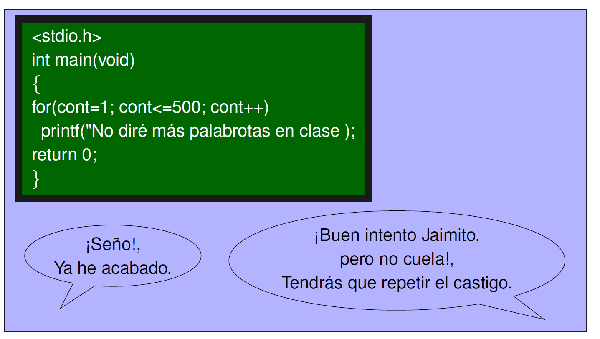

<link rel="stylesheet" type="text/css" href="estilo.css" media="screen" />

# Programación estructurada. Iterativa

A menudo en la resolución de un problema es necesario ejecutar  una instrucción o un bloque de instrucciones más de una vez. Por  ejemplo **Implementar un programa que calcule  la suma de N números leídos desde teclado**.

 Se podría escribir un programa en el que  que apareciese repetido el código que deseamos, pero tenemos varios inconvenientes. El primero es que el programa resultante sería muy largo, el segundo  que tendríamos mucho código duplicado lo que dificulta los futuros cambios en el código y el más importante que una vez escrito el programa para un número determinado de repeticiones (p.ej. sumar matrices 3x3), el mismo programa no podríamos reutilizarlo si necesitásemos realizar un número distinto de operaciones (p.ej. matrices 4x4).

 Las estructuras  de  control  repetitivas  o  iterativas,  también conocidas   como   **bucles**,   nos   permiten   resolver   este tipo de problemas. Algunas se pueden usar cuando   el   número   de   veces   que   deben   repetirse   las operaciones es conocido y     otras       permiten    repetir    un    conjunto    de operaciones mientras se cumpla una condición.

## Problemas donde se necesita utilizar bucles

### Mayor temperatura
>  

Construir un programa que calcule e imprima la mayor de un conjunto de datos de temperaturas introducidas por teclado. El número de datos es conocido a priori (se lee porteclado).

&ensp;&ensp;&ensp;  [  excesoVelocidad.psc](./Selectiva/excesoVelocidad.psc) [Ver](https://github.com/MaterialesProgramacion/ProblemasProgramacion/blob/master/Selectiva/excesoVelocidad.psc)
&ensp;&ensp;&ensp;  [ excesoVelocidad.c](./Selectiva/excesoVelocidad.c)

### Mayor temperatura con centinela

Construir un programa que calcule e imprima la mayor de un conjunto de datos de temperaturas introducidas por teclado. El número de datos no es conocido a priori, finalizándose la introducción de datos con el valor –999.

### Fuerzas concurrentes
Construir un programa que calcule e imprima la resultante de un conjunto de fuerzas concurrentes. Las componentes espaciales de cada fuerza son introducidas por
teclado de una en una, finalizándose la entrada de datos con una fuerza nula

### Adivinar un número
Construir un programa que sea capaz de adivinar un número menor que 100, definido al azar en n intentos.

### Sucesión de Fibonacci

Construir un programa que calcule e imprima en pantalla el término n-ésimo
de la serie de Fibonacci, dado por teclado el número del término a calcular

### Producto de Wallis

Construir un programa que calcule el producto de Wallis (expresión utilizada
en matemáticas para representar el valor de PI/2), hasta un factor tal que la diferencia en
valor absoluto entre dicho término y el número 1 sea inferior a un valor dado (precisión). El
programa leerá por teclado dicho valor de precisión, calculará el producto de Wallis hasta el
término correspondiente (sin incluirlo) utilizando la siguiente fórmula y presentará el resultado
en la pantalla

### Sumatoria

Construir un programa que calcule e imprima en pantalla la suma,
Pn
i=1(i=2i)
donde el número de sumandos se introduce por teclado

### Máximo Comun Divisor

Construir un programa que calcule e imprima en pantalla el máximo común
divisor de dos números enteros positivos introducidos por teclado

## Problemas donde se necesita utilizar bucles anidados

###  Tabla de multiplicar
Construir un programa que imprima en pantalla la tabla de multiplicar de los 9
primeros números naturales

********************************
[Capítulo anterior. Selectiva](selectiva.md)
|
[Capítulo siguiente. Modulos](modulos.md)
